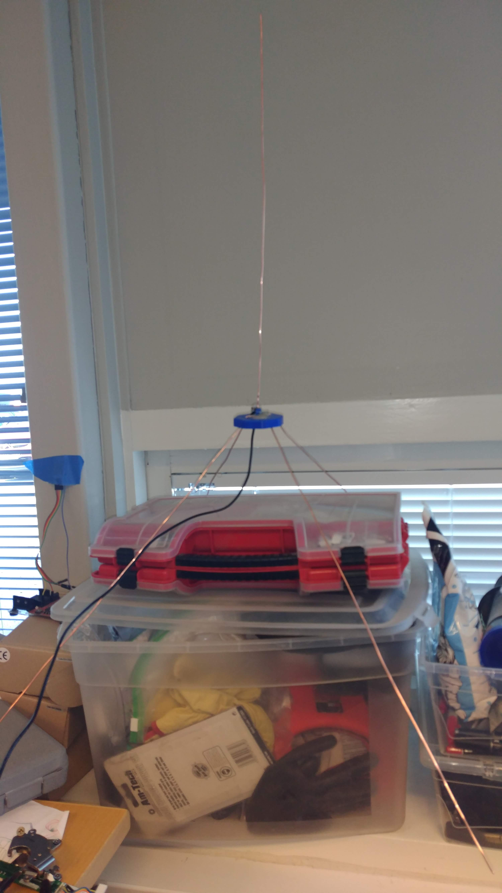

# ElCheapoAIS
AIS receiver with DIY antenna and cheap RTL-SDR tuner 

## Hardware
* Tuner https://www.ebay.com/itm/USB2-0-DAB-FM-DVB-T-RTL2832U-R820T2-SDR-RTL-SDR-Dongle-Stick-Digital-TV-Tun-W8M8/283032648261
* Antenna

## Software

### Testing (Windows)
* AISRecWinFull https://sites.google.com/site/feverlaysoft/home
* OpenCPN

### Final setup (Raspbian/Raspberry Pi)
* -
