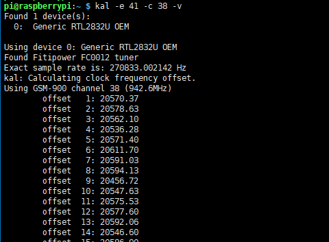

# Quick guide
1. You need: Raspberry Pi, USB RTL SDR tuner, materials for building the antenna
2. Craft the antenna (_see instructions below_)
3. Install newest raspbian light in the RPi
4. Prepare the destination of the AIS data (_i.e. create AISHub account_)
5. Execute `wget -q -O - https://git.io/fA6Wx | sudo bash`
6. Follow the instructions
7. Profit?

# ElCheapoAIS
AIS receiver with DIY antenna and cheap RTL-SDR tuner 

## Hardware
* Tuner https://www.ebay.com/itm/USB2-0-DAB-FM-DVB-T-RTL2832U-R820T2-SDR-RTL-SDR-Dongle-Stick-Digital-TV-Tun-W8M8/283032648261
* Antenna

### Build the antenna
The measurements of the antenna are based on https://m0ukd.com/calculators/quarter-wave-ground-plane-antenna-calculator/ for a 162 Mhz antenna. 

Check the upper link for more details on how to build the antenna. The center piece holder can be 3d printed https://www.thingiverse.com/thing:3099905

## Software

### Windows (Testing)
* AISRecWinFull https://sites.google.com/site/feverlaysoft/home
* OpenCPN
    * Set the same ip and port in OpenCPN and AISRecWinFull, and start the later

### Raspbian/Raspberry Pi
Using kalibrate-rtl and rtl-ais.

#### Setup

      sudo apt install build-essential libtool m4 automake libfftw3-dev automake autoconf
      git clone https://github.com/steve-m/kalibrate-rtl
      cd kalibrate-rtl
      ./bootstrap && CXXFLAGS='-W -Wall -O3'
      ./configure
      make
      sudo make install

Now scan for base stations

      kal -g 42 -e 22 -s 850
      kal -g 42 -e 22 -s 900
      etc…
      
Example output

Find ppm error using the strongest channel from previous attempts

      kal -e 41 -c <strongest channel> -v
      
Example output

Copy the `ppm` value at the end of the output from the last step. You can write decimals in the `-p` argument, but it will parsed as integer.

Compile rtl_ais

      sudo apt install git librtlsdr-dev libusb-dev libpthread-workqueue-dev
      git clone https://github.com/dgiardini/rtl-ais 		
      cd rtl-ais
      make

Run rtl_ais

      sudo ./rtl_ais -n -h <UDP_SERVER> -P <PORT_SERVER> -p <PPM_ERROR> -g 60 -S 60

Done!

#### Run on boot

      sudo nano /etc/rc.local
 
Add the following lines on top of the last exit line, save and reboot

      cd /home/pi/rtl-ais/ & sudo ./rtl_ais -n -h <UDP_SERVER> -P <PORT_SERVER> -p <PPM_ERROR> -g 60 -S 60  &>> "log/ais.$(date +%Y-%m-%d_%H:%M).log"
